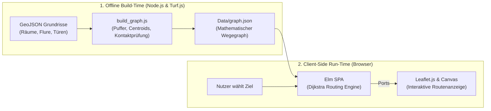

# 🧭 KrokenKompass Wiki - Home

Willkommen in der offiziellen Dokumentation von **KrokenKompass**! 

**KrokenKompass** ist ein modernes, hochperformantes und hardwareloses **Indoor- & Campus-Navigationssystem** für die **Martin-Luther-Universität Halle-Wittenberg (MLU)**, aktuell fokussiert auf den **Heide-Campus** (u.a. Von-Seckendorff-Platz 1–4).

---

## 🗺️ Inhaltsverzeichnis

* [🏗️ **1. Architektur & Technologien**](Architektur-&-Technologien.md) – High-Level-Systemübersicht, Build- vs. Run-Time, Komponenten & Design-Entscheidungen.
* [⚙️ **2. Backend & Graphenerstellung**](Backend-&-Graphenerstellung.md) – Geometrieverarbeitung mit Turf.js, Pufferzonen, Kantenberechnung & Strafmetriken.
* [🖥️ **3. Frontend & Elm-Architektur**](Frontend-&-Elm-Architektur.md) – Die Elm SPA, Dijkstra-Routing im Browser, Port-Kommunikation & Leaflet-Kartenanzeige.
* [🎨 **4. UI, Theming & Design-System**](UI-Theming-&-Design-System.md) – Dual-Logo-System, Dark/Light Mode, Bulma 1.0 & Responsive Design.
* [🚀 **5. Deployment & CI/CD**](Deployment-&-CI-CD.md) – GitHub Pages Workflow, Vercel-Konfiguration & automatisierte Build-Pipelines.
* [🛠️ **6. Installation & Developer Guide**](Installation-&-Developer-Guide.md) – Lokale Einrichtung, Entwicklungsworkflow & Troubleshooting.

---

## 💡 Was macht KrokenKompass besonders?

Herkömmliche Indoor-Navigationssysteme scheitern oft an zwei Hürden:
1. **Teure Hardware:** Notwendigkeit von Bluetooth-Beacons, Ultra-Wideband (UWB) oder WLAN-Fingerprinting.
2. **Schwere Server-Last:** Serverseitige Berechnung von Polygon-Schnitten bei jedem einzelnen Routing-Aufruf führt zu Latenzen und Serverkosten.

**KrokenKompass löst dies durch eine zweistufige Architektur:**

1. **Offline-Vorverarbeitung:** Räumliche CAD/GeoJSON-Geometrien werden einmalig im Vorfeld analysiert und in einen optimierten, rein mathematischen Wegegraphen (`graph.json`) überführt.
2. **Client-Side-Routing:** Der Browser lädt diesen kompakten Graphen einmalig herunter. Das Routing (Dijkstra) läuft in Millisekunden **rein lokal im Browser** via [Elm](https://elm-lang.org/) – ohne Laufzeitfehler und ohne ständige Serveranfragen.

---

## 📊 Kernmetriken

* **Frontend:** Elm 0.19.1 + Leaflet.js 1.9.4 + Bulma 1.0.4
* **Backend / Pre-Processing:** Node.js + Turf.js 7.3.5
* **Routing-Algorithmus:** Dijkstra (clientseitig ausgeführt)
* **Knotenpunkte:** ~1.500+ Knoten über mehrere Gebäude und Etagen (UG bis 5. OG)

---
*Navigation:* [🏗️ Weiter zu Architektur & Technologien →](Architektur-&-Technologien.md)
