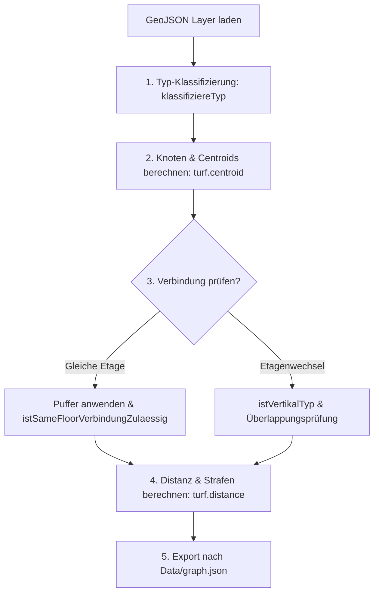

Das "Backend" von KrokenKompass ist ein **Build-Time-Skript** in Node.js ([`Code/backend/build_graph.js`](file:///Users/niklas/WebstormProjects/KrokenKompass/Code/backend/build_graph.js)). Seine Aufgabe ist es, unzählige zweidimensionale Raum-Polygone in ein mathematisches Wegenetzwerk (einen Graphen) zu transformieren.

---

## 📂 Rohdaten & GeoJSON-Struktur

Die Grundrisse liegen als GeoJSON-Dateien im Ordner `Data/` vor:
* `vsp_etage_-1.json` (Untergeschoss)
* `vsp_etage_00.json` (Erdgeschoss)
* `vsp_etage_01.json` bis `vsp_etage_05.json` (1. bis 5. Obergeschoss)

Jedes Feature (Polygon) enthält Metadaten:
```json
{
  "type": "Feature",
  "properties": {
    "unit_id": "7724_00_017",
    "name": "7724_00_017",
    "use_type": "Tuer",
    "gebaeude": "7724",
    "etage": "00"
  },
  "geometry": { "type": "Polygon", "coordinates": [...] }
}
```

---

## 🧠 Der Transformationsprozess (`build_graph.js`)



### 1. Typ-Klassifizierung (`klassifiziereTyp`)
Die Rohdaten-Werte in `use_type` werden normiert:
* `tuer`, `eingang`, `lobby`, `durchgang`
* `vertikal` (Treppenhäuser, Aufzüge)
* `flur` (Gänge, Wege im Freien)
* `raum` (Büros, Hörsäle, Seminarräume, Labore, Toiletten)

### 2. Centroid-Ermittlung
Für jedes Feature wird der Repräsentationspunkt (Knoten) ermittelt:
```javascript
let centroid = turf.centroid(feature);
// Fallback bei unregelmäßigen L- oder U-Formen:
if (!turf.booleanPointInPolygon(centroid, feature)) {
    centroid = turf.pointOnFeature(feature);
}
```

### 3. Kantenfindung & Pufferzonen (Toleranzen)
CAD-Pläne weisen oft minimale Lücken (wenige Zentimeter) zwischen Türen und Fluren auf. Ohne Toleranzpuffer würden Räume isoliert bleiben.

* **Standard-Innenraumpuffer:** `1.0 Meter`  
  *Stellt sicher, dass Türen, Räume und Innenflure zuverlässig Kanten bilden (wichtig z.B. für Gebäude 7724 / VSP 4).*
* **Outdoor- / Wegebereichspuffer:** `3.0 Meter`  
  *Verbindet breite Übergänge und Wege auf dem Campus.*
* **Vertikalpuffer (Treppen/Aufzüge):** `3.0 Meter`  
  *Gleicht minimale vertikale CAD-Verschiebungen zwischen den Stockwerken aus.*

### 4. Heuristiken & Strafdistanzen (Penalties)

Der kürzeste geometrische Weg ist nicht immer der logischste menschliche Weg. Niemand möchte auf dem Weg zum Hörsaal quer durch drei benachbarte Professoren-Büros laufen, nur weil diese aneinandergrenzen.

| Verbindungstyp | Distanzberechnung | Zweck |
| :--- | :--- | :--- |
| **Flur ↔ Flur** | Reale Distanz (Meter) | Bevorzugter Standardweg. |
| **Flur ↔ Tür / Raum** | Reale Distanz (Meter) | Normaler Zugang zum Raum. |
| **Raum ↔ Raum** | Reale Distanz **+ 5.000 m** | Verhindert "Büro-Hopping". Der Weg wird vom Dijkstra nur gewählt, wenn der Raum Start oder Ziel ist. |
| **Tür ↔ Tür** | Reale Distanz **+ 500 m** | Verhindert unnötiges Wechseln durch benachbarte Türen. |
| **Stockwerkwechsel** | Fiktive **5 m** | Simuliert Treppen-/Aufzugskosten. |

---

## 📄 Struktur der Ausgabedatei (`Data/graph.json`)

Die generierte Datei ist extrem kompakt und wird von Elm direkt konsumiert:

```json
{
  "graph": {
    "7724_00_017_tuer_123": {
      "7724_00_001_flur_456": 4.82,
      "7724_00_018_raum_789": 5003.12
    }
  },
  "centroids": {
    "7724_00_017_tuer_123": [11.94215, 51.49812]
  },
  "nodeMeta": {
    "7724_00_017_tuer_123": {
      "name": "7724_00_017",
      "typ": "tuer",
      "rawTyp": "Tuer",
      "gebaeude": "7724",
      "etage": "00"
    }
  }
}
```

---
*Navigation:* [← Zurück zur Home-Seite](Home) | [🎨 Weiter zu UI, Theming & Design-System →](🎨-UI,-Theming-&-Design‐System)
