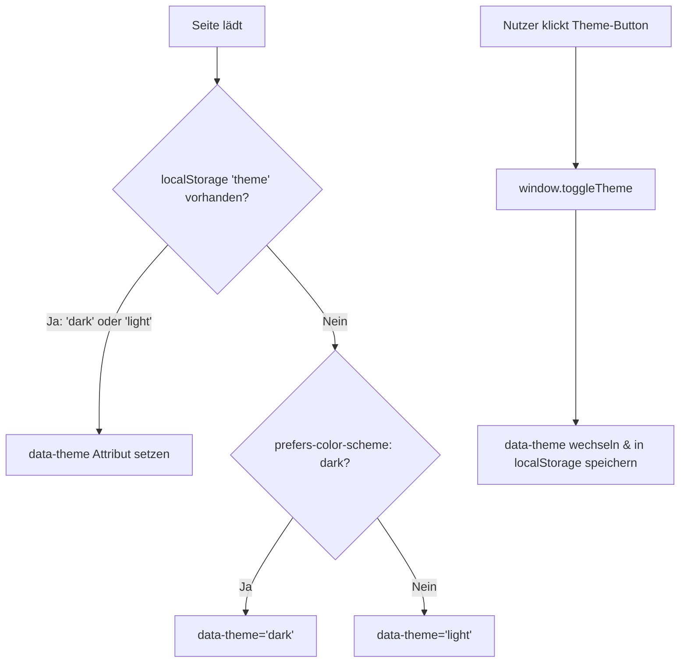

KrokenKompass setzt auf ein klares, modernes und barrierearmes Interface, das sowohl auf Desktop-Bildschirmen als auch auf mobilen Endgeräten (Smartphones auf dem Campus) optimal funktioniert.

---

## 🌓 Dark & Light Mode Architektur

Das Theme-System unterstützt sowohl **automatische Erkennung der Systemeinstellung** als auch **manuelles Umschalten** durch den Nutzer.



### CSS-Variablen & Bulma-Integration (`style.css`)
```css
:root {
    --figma-blue: #007AFF;
    --bulma-info: var(--figma-blue);
    --button-light-bg: #f2f2f7;
}

html[data-theme="dark"] {
    --bulma-info: #64D2FF;
    --bulma-info-invert: #000000;
    --button-light-bg: #2C2C2E;
}
```

---

## 🧭 Das Dual-Logo-System

Um optimalen Kontrast auf allen Hintergründen zu garantieren, schaltet die UI automatisch zwischen zwei angepassten Logo-Dateien um:

| Theme | Hintergrund | Verwendetes Logo | Datei |
| :--- | :--- | :--- | :--- |
| **Light Mode** | Hell (`#ffffff`) | **Dunkles Logo** | `Code/frontend/svgs/KK-Logo-dark.png` |
| **Dark Mode** | Dunkel (`#1c1c1e`) | **Helles Logo** | `Code/frontend/svgs/KK-Logo-Light.png` |
| **Favicon** | Browser-Tab | **Dunkles Logo** | `Code/frontend/svgs/KK-Logo-dark.png` |

### CSS-Switching-Logik:
```css
/* Logo-Umschaltung ohne Flackern per CSS */
html[data-theme="dark"] .logo-light-mode { display: none !important; }
html[data-theme="dark"] .logo-dark-mode { display: inline-block !important; }
html:not([data-theme="dark"]) .logo-light-mode { display: inline-block !important; }
html:not([data-theme="dark"]) .logo-dark-mode { display: none !important; }
```

---

## 📱 Responsive Layout & UI-Komponenten

### 1. Floating Route Pill
Die Sucheingabefelder für Start und Ziel sind als schwebende "Pill"-Komponenten mit Fokus-Animationen und animierten Such-Dropdowns gestaltet.

### 2. Etagen-Auswahlmenü
Ein vertikales Menü am rechten Bildschirmrand ermöglicht den schnellen Wechsel zwischen den Geschossen (UG bis 5. OG) mit optischer Hervorhebung des aktiven Stockwerks.

### 3. Footer & Versionsanzeige
Die Fußleiste am unteren Bildschirmrand zeigt neben dem Logo und dem GitHub-Link die **Release- und Build-Informationen** an:
* Format: `vX.X.X - XXXXXXX`
* Die Release-Version verlinkt direkt auf das neueste GitHub-Release (`/releases/latest`), während der 7-stellige Git-Commit-Hash auf den jeweiligen Commit (`/commit/XXXXXXX`) verlinkt.

### 4. Responsive Breakpoints
* **Desktop (≥ 769px):** Vollständige Header- und Footer-Leiste, symmetrische Aktions-Buttons.
* **Mobile (< 768px):** Angepasste Schriftgrößen (`hero-title-custom`), vertikal gestapelte Buttons und kompakte Header-Abstände für Einhand-Bedienung.

---
*Navigation:* [← Zurück zu Backend & Graphenerstellung](⚙️-Backend-&-Graphenerstellung) | [🏗️ Weiter zu Architektur & Technologien →](🏗️-Architektur-&-Technologien)
