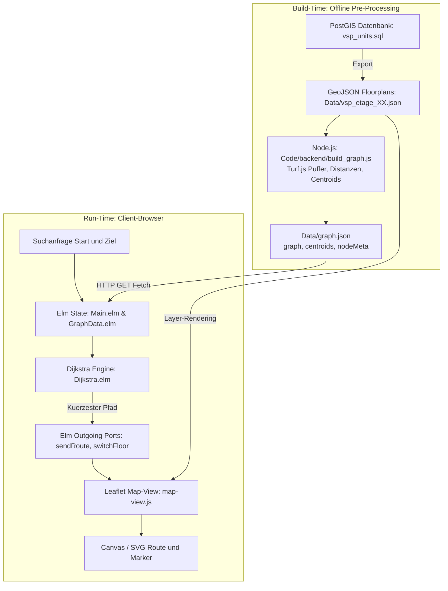

KrokenKompass setzt auf eine **strikte Trennung von Datenaufbereitung (Build-Time) und Laufzeitumgebung (Run-Time)**, um maximale Performance, Fehlertoleranz und Skalierbarkeit zu gewährleisten.

---

## 🏛️ Systemübersicht

---

## 🛠️ Technologie-Stack

### 1. Datenvorbereitung & Pre-Processing (Backend)
* **Node.js**: Führt das Vorverarbeitungsskript aus (`node Code/backend/build_graph.js`).
* **Turf.js (`@turf/turf` 7.4.0)**: Eine JavaScript-Bibliothek für räumliche Geometrie-Operationen. Sie übernimmt:
  * Berechnung von Mittelpunkten (`turf.centroid` / `turf.pointOnFeature`)
  * Pufferung von Polygonen (`turf.buffer`), um minimale CAD-Zeichenungenauigkeiten zu überbrücken
  * Schnittpunktprüfungen (`turf.booleanIntersects`)
  * Distanzberechnungen in Metern (`turf.distance`)

### 2. Frontend-Logik & Routing Engine (Elm)
* **Elm (0.19.1)**: Rein funktionale, typsichere Sprache.
  * **Zero Runtime Exceptions:** Elm garantiert zur Laufzeit absolute Stabilität (keine `null`-Pointer, keine `undefined is not a function`-Crashes).
  * **Dijkstra-Algorithmus (`Dijkstra.elm`):** Berechnet Routen in unter 5 Millisekunden direkt im Browser, ohne Netzwerklatenz.
  * **Dekodierung (`GraphData.elm`):** Parst die kompakte `graph.json` in performante Elm-Dicts und IntDicts.

### 3. Visualisierung & Karten-Rendering (Leaflet.js)
* **Leaflet.js (1.9.4)**: Leichtgewichtige, mobile-optimierte Kartenbibliothek.
* **Ports-Brücke:** Elm steuert Leaflet asynchron über JavaScript-Ports (`sendRoute`, `switchFloor`, `routingFailed`).
* **Multi-Floor Rendering:** Zeichnet Räume, Flure und berechnete Routen-Polylines auf der aktiven Etage und blendet bei Stockwerkwechseln interaktive Buttons ein.

### 4. UI-Framework & Styling (Bulma & Custom CSS)
* **Bulma CSS (1.0.4)**: Modernes CSS-Framework für responsive Layouts.
* **Custom CSS (`Code/frontend/cssFiles/style.css`)**: Speziell gestaltete Such-Pills, animierte Dropdowns, Floating-Header und Dark/Light-Theme-Switching.

---

## 🔄 Der vollständige Datenfluss

| Schritt | Phase | Beschreibung |
| :--- | :--- | :--- |
| **1. Export** | Vorbereitung | Gebäudegrundrisse werden als GeoJSON (`Data/vsp_etage_-1.json` bis `vsp_etage_05.json`) abgelegt. |
| **2. Graph-Build** | Build-Time | `build_graph.js` analysiert Raumkontakte, vergibt Kanten und Strafen und erzeugt `Data/graph.json`. |
| **3. Initialisierung** | Ladezeit | Browser öffnet `index.html`. Elm lädt `graph.json` via HTTP; Leaflet lädt die GeoJSON-Layer für Etage 00. |
| **4. Suche & Auswahl** | Interaktion | Nutzer tippt Raum ein. Elm filtert `nodeMeta` und bietet Autocomplete-Vorschläge an. |
| **5. Routing** | Laufzeit | Bei Auswahl startet `Dijkstra.elm`. Der optimale Pfad wird über Ports an `map-view.js` gesendet. |
| **6. Zeichnen** | Darstellung | `map-view.js` zeichnet die Route mit `L.polyline`, hebt Start-/Zielräume hervor und fokussiert die Karte. |

---
*Navigation:* [← Zurück zu UI, Theming & Design-System](🎨-UI,-Theming-&-Design‐System) | [🖥️ Weiter zu Frontend & Elm-Architektur →](🖥️-Frontend-&-Elm‐Architektur)
