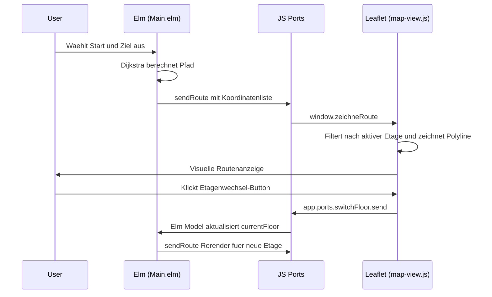

Das Frontend von **KrokenKompass** ist eine Single-Page-Application (SPA), die auf der **Elm-Architektur (TEA)** basiert und über **Ports** mit der interaktiven Kartenbibliothek **Leaflet.js** kommuniziert.

---

## 🏛️ Die Elm-Module (`Code/frontend/src/`)

```
Code/frontend/src/
├── Main.elm        # State Machine (Model), UI (View), Update-Logik, Port-Definitionen
├── Dijkstra.elm    # Rein funktionale Dijkstra-Implementierung für Kürzeste-Wege
└── GraphData.elm   # JSON-Decoder für graph.json & Hilfsfunktionen (getBestNodeId)
```

---

## 🧩 Modul-Details

### 1. `Main.elm` – Der Orchestrator
* **Flags & Initialisierung:** Beim Start empfängt Elm ein strukturiertes `Flags`-Objekt `{ release: String, commit: String }` von `inject_version.js`. Damit rendert die App im Footer stets das aktuelle Release (`v1.0.0`) und den dazugehörigen Git-Commit (`fba17ba`) mit interaktiven Links zu GitHub.
* **Model:** Verwaltet den gesamten Zustand:
  * `graphData: Maybe GraphData` (der geladene Wegegraph)
  * `startInput: String`, `endInput: String` (Text in den Suchfeldern)
  * `startNode: Maybe NodeId`, `targetNode: Maybe NodeId` (ausgewählte Knoten)
  * `currentFloor: String` (aktiv angezeigte Etage, z.B. `"00"`)
  * `route: Maybe (List NodeId)` (aktuell berechneter Weg)
  * `version: Flags` (Release- und Commit-Informationen)
* **Autocomplete & Filtering:** Sobald der Nutzer tippt, filtert Elm `nodeMeta` und rendert Dropdown-Vorschläge.
* **Routing-Aufruf:** Wenn Start und Ziel gesetzt sind, übergibt Elm die Knoten an `Dijkstra.findPath`.

### 2. `Dijkstra.elm` – Der Pfadfinder
Eine rein funktionale Implementierung des Dijkstra-Algorithmus:
* **Signatur:** `findPath : Graph -> NodeId -> NodeId -> Maybe (List NodeId)`
* **Ablauf:**
  1. Initialisiert Kosten-Tabelle (`Dict NodeId Float`) mit `0.0` für Start und `Infinity` für alle anderen Knoten.
  2. Pflegt eine Vorgänger-Tabelle (`Dict NodeId NodeId`), um den Pfad am Ende rückwärts zu rekonstruieren.
  3. Evaluiert rekursiv Nachbarkanten und wählt stets den unbesuchten Knoten mit den geringsten akkumulierten Kosten.
  4. Liefert `Just (List NodeId)` zurück (oder `Nothing`, falls kein Weg existiert).

### 3. `GraphData.elm` – Datenmodellierung & Einstiegspunkte
* **JSON-Decoder:** Parst `graph`, `centroids` und `nodeMeta` typ- und fehlerfrei.
* **`getBestNodeId` (Smart Entry Node Selection):**  
  Wenn ein Nutzer z.B. nach Raum `"3.01"` sucht, existieren im Graphen oft mehrere Knoten (z.B. der Raum-Centroid selbst und die Tür davor).  
  `getBestNodeId` wählt nach folgender Priorität den besten Routing-Knoten:
  $$\text{Priorität: } \text{Tür} > \text{Flur} > \text{Vertikal} > \text{Raum}$$

---

## 🌉 Die Port-Schnittstelle (Elm ↔ JavaScript)

Elm interagiert mit der Außenwelt (DOM, Leaflet, Browser-APIs) ausschließlich über typisierte Ports:



### Definierte Ports:
1. **`sendRoute` (Elm → JS):** Übergibt die Liste der Knoten-Koordinaten und Metadaten zum Zeichnen der Route.
2. **`switchFloor` (Elm ↔ JS):** Synchronisiert den Etagenwechsel zwischen Elm-UI und Leaflet-Kartenlayer.
3. **`routingFailed` (Elm → JS):** Informiert über unüberbrückbare Start-/Zielpaare.
4. **`toggleThemeCmd` (Elm → JS):** Schaltet Dark/Light-Theme im Browser um.

---

## 🗺️ Karten-Rendering (`Code/frontend/map-view.js`)

* **Layer-Management:** Jede Etage besitzt einen eigenen `L.geoJSON`-Layer. Beim Etagenwechsel wird der vorherige Layer entfernt und der neue eingeblendet.
* **Routen-Slicing:** Da Gebäudepläne pro Etage gerendert werden, filtert `map-view.js` die vom Dijkstra gelieferte Route so, dass nur die Punkte sichtbar sind, die auf der aktuellen Etage liegen.
* **Interaktive Treppen- & Aufzugs-Buttons:** Wenn eine Route über ein `vertikal`-Element die Etage wechselt, platziert Leaflet dynamisch klickbare Buttons auf der Karte ("↑ In 1. OG wechseln"), die direkt zur nächsten Etage navigieren.
* **Farb-Codierung der Räume (`gibFeatureStyle`):**
  * Flure / Durchgänge: Neutralgrau
  * Türen: Orange/Akzent
  * Vertikal (Treppen/Aufzug): Violett
  * Startpunkt: Grün
  * Zielpunkt: Rot

---
*Navigation:* [← Zurück zu Architektur & Technologien](🏗️-Architektur-&-Technologien) | [🚀 Weiter zu Deployment & CI/CD Pipelines →](🚀-Deployment-&-CI-CD-Pipelines)