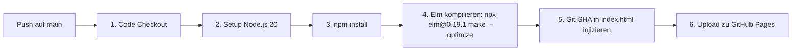

KrokenKompass ist so konfiguriert, dass es vollautomatisiert sowohl auf **GitHub Pages** als auch auf **Vercel** bereitgestellt werden kann.

---

## 1. GitHub Pages Pipeline (`.github/workflows/deploy.yml`)

Bei jedem Push in den Branch `main` führt GitHub Actions die Build-Pipeline aus:



### Die Workflow-Schritte im Detail:
1. **Elm-Kompilierung:** Kompiliert `Code/frontend/src/Main.elm` direkt zu `Code/frontend/elm.js` unter Einsatz des `--optimize`-Flags (Code-Minification & Dead-Code-Elimination).
2. **Version-Tagging:** Ersetzt den Platzhalter `dev-local` in `index.html` mit den ersten 7 Zeichen des Git-Commit-Hashes (`$SHORT_SHA`), sodass in der Footer-Leiste stets die exakt gebaute Version angezeigt wird.

---

## 2. Vercel Deployment

Vercel ermöglicht einfache Preview-Deployments für jeden Pull Request sowie kontinuierliche Production-Releases.

### Konfigurationsdateien:

#### `package.json`
Definiert den Build-Befehl, den Vercel beim Klonen ausführt:
```json
{
  "scripts": {
    "build": "cd Code/frontend && npx elm make src/Main.elm --output=elm.js --optimize"
  },
  "devDependencies": {
    "elm": "0.19.1-5"
  },
  "dependencies": {
    "@turf/turf": "^7.3.5"
  }
}
```

#### `vercel.json`
Da KrokenKompass eine statische Single-Page-Application ist, deren `index.html` direkt im Hauptverzeichnis liegt, definiert `vercel.json` den Root-Ordner als Output:
```json
{
  "outputDirectory": "."
}
```

---

## 🛡️ Warum `elm.js` in `.gitignore` steht

* **Kein Binär-/Build-Müll im Git-Verlauf:** `elm.js` ist ein kompiliertes Artefakt (~9.000+ Zeilen generiertes JS).
* **Konsistente Builds:** Durch das Einbinden von `elm make` in die CI/CD-Pipelines (GitHub Actions & Vercel) wird sichergestellt, dass jeder Build deterministisch und frisch aus dem Quellcode erzeugt wird.

---
*Navigation:* [← Zurück zum UI & Theming](UI-Theming-&-Design-System.md) | [🛠️ Weiter zum Installation & Developer Guide →](Installation-&-Developer-Guide.md)
